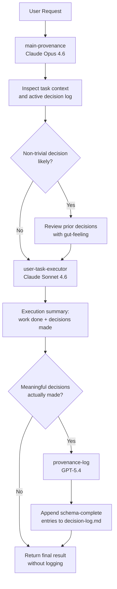
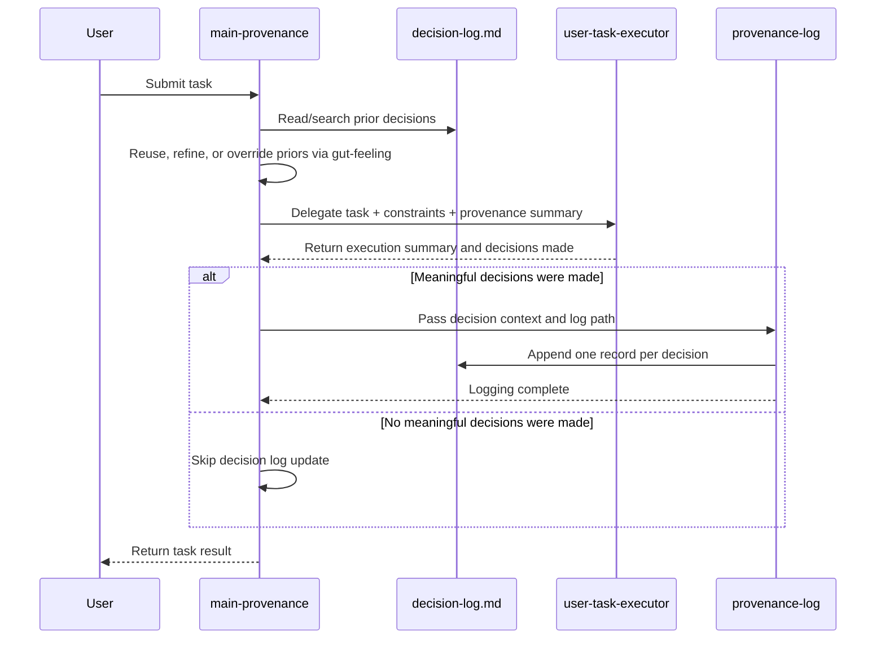

# Decision Provenance - evolution of results across test scenarios and iterations

## Experiment Overview

### Purpose

This experiment was designed to validate two things about the decision provenance approach:

1. Whether an agent can self-identify the meaningful decisions it makes, classify their importance, and log both the decision and its context.
2. Whether an agent can later reuse prior decision logs as a kind of virtual gut feeling and improve its decision-making quality and consistency.

### High-Level Scenario

This report now covers four iterations across three decision prompt families plus one negative-control prompt:

- `Iterations 1 and 2` use a roadmap-prioritization prompt for an AI-powered document platform
- the model must choose exactly one primary initiative and one secondary initiative from `A) AI contract generation`, `B) Analytics dashboard`, `C) Workflow automation`, `D) Real-time collaboration improvements`
- the decision is shaped by low trust in AI outputs, sales pressure for AI features, engineering overload from tech debt, and a competitor launch in workflow automation
- `Iteration 3` uses a rollout-and-safety prompt for an AI summarization feature in a document platform
- the model must make two explicit decisions: one release-scope choice and one safety-guardrail choice
- that decision is shaped by low customer trust, enterprise delivery pressure, engineering overload, and legal sensitivity to harmful output
- `Iteration 4` uses a six-prompt validation suite executed through a split-agent architecture:
  - `main-provenance` on `Claude Opus 4.6`
  - `user-task-executor` on `Claude Sonnet 4.6`
  - `provenance-log` on `GPT-5.4`
- that fourth suite reuses the roadmap and rollout prompts and adds stale-prior, conflicting-prior, escalation, and negative-control prompts

Together, these form a progressively stronger evaluation suite for decision provenance. The roadmap prompts are intentionally ambiguous and trade-off heavy, which makes them strong for measuring reuse effects on judgment. The rollout-and-safety prompt is more constrained but explicitly multi-decision, which makes it strong for testing whether the provenance layer can detect, separate, and log more than one material decision in the same task. The fourth-iteration suite then tests whether the earlier model-role conclusions actually improve the system when those roles are split across agents.

### Why This Scenario Was Chosen

These scenarios were chosen as complementary tests of the same provenance mechanism:

- whether the agent can recognize that product strategy, rollout, safety, and release-governance choices are meaningful decisions worth logging
- whether it can explain and classify trade-offs rather than just produce an answer
- whether prior decisions help narrow the option set when the problem is ambiguous but structurally similar across runs
- whether the logger can preserve decision granularity when the task contains two explicit decisions instead of one bundled choice
- whether reuse improves consistency without completely replacing fresh judgment
- whether stale priors are overridden when the context changes materially
- whether conflicting priors are handled as soft evidence rather than as majority vote
- whether the system can avoid inventing fake decision logs on a non-decision control prompt

The roadmap prompt is especially useful for comparing warm-start effects because multiple answer pairs are defensible. The rollout-and-safety prompt is especially useful for comparing logging completeness because the expected decision structure is explicit and easy to audit. The fourth iteration matters because it is the first system-evolution test: it checks whether the earlier conclusion, "use Claude-like judgment plus GPT-like logging," actually produces better provenance behavior in practice.

### Prompt Context And Expected Result

The prompt family asks the model to make product decisions or controlled non-decision edits, but the required deliverable is intentionally narrow:

- write the final decision to `decision_logging_test_result[seconds timestamp].md`
- include front matter fields such as timestamp, model, date, and type
- include a `Context` section and an `Options Evaluated` section
- for the roadmap prompts, include `Final Decision` and select one primary and one secondary initiative
- for the rollout-and-safety prompt, include `Final Decision 1` and `Final Decision 2` and select one release-scope option plus one safety-guardrail option
- for the escalation prompt, include `Final Decision` and select one release option, with escalation made explicit if appropriate
- for the negative-control prompt, rewrite the text clearly without changing its meaning and without introducing a material decision

That means the prompts directly require only the task output artifact. They do **not** directly require the separate provenance log. Because of that, any corresponding entry in `decision-log.md`, `decision-log-cold.md`, or `decision-log-warm.md` is evidence that the decision-logging mechanism activated on its own and correctly identified the underlying choice as a meaningful decision.

So there are two expected outputs at evaluation time:

- the explicit task result file required by the prompt
- the implicit decision-log entry created by the provenance mechanism when the setup is working correctly

The important exception is the negative-control rewrite prompt in iteration 4. For that case, the correct behavior is the opposite:

- produce the explicit rewrite artifact
- produce **no** decision-log entry, because no meaningful decision should be detected

### Why Cold Start And Warm Start Both Exist

The experiment uses both cold and warm starts to separate two different capabilities.

Cold start is meant to test independent reasoning and logging discipline:

- the model should solve the scenario without reusing earlier decision history
- this shows whether it can identify, classify, and log the decision on its own

Warm start is meant to test reusable decision memory:

- the model sees prior decision-log entries from similar earlier runs
- this shows whether previous decisions can act like a soft prior or virtual gut feeling
- the model should decide whether prior reasoning should be reused, refined, or overridden

So the key intended difference between cold and warm start is not the business scenario itself. Within each iteration, the scenario stays the same. What changes is whether prior decision history is available and allowed to influence the new choice.

### Why The Same Prompt Was Run Across Different Models

Within each iteration, the same prompt was run across multiple models for a methodological reason: it keeps the task constant while varying the model.

That allows the experiment to compare:

- whether decision logging is robust across different model families rather than specific to one model
- how different models express trade-offs, schema discipline, and reuse behavior
- whether convergence in warm start reflects a general provenance effect or just one model's preference
- which behaviors are stable across models and which are model-specific

Using the same prompt across different models also reduces a major source of noise. If the prompt changed between runs inside the same iteration, it would be much harder to tell whether output differences came from the model, the provenance setup, or the task framing itself.

### Artifacts Used

- `.github/skills/decision-log/SKILL.md` and `.github/skills/gut-feeling/SKILL.md` - the active strict-skill contracts used in the later iterations
- `.github/agents/task-with-decision-log.agent.md` and `.github/agents/task-with-gut-feeling-decision-log.agent.md` - the single-agent setups used in iterations 2 and 3
- `.github/agents/main-provenance.agent.md`, `.github/agents/user-task-executor.agent.md`, and `.github/agents/provenance-log.agent.md` - the split-agent architecture introduced for iteration 4
- `DECISION_LOGGING_TEST_PROMPT1.md` and `DECISION_LOGGING_TEST_PROMPT1-cold.md` - roadmap-prioritization prompts used in iterations 1 and 2, and reused in iteration 4
- `DECISION_LOGGING_TEST_PROMPT2-stale-prior.md` and `DECISION_LOGGING_TEST_PROMPT3-conflicting-priors.md` - prior-handling probes added in iteration 4
- `DECISION_LOGGING_TEST_PROMPT4-multi-decision.md` and `DECISION_LOGGING_TEST_PROMPT4-multi-decision-cold.md` - rollout-and-safety prompts used in iteration 3 and reused in iteration 4
- `DECISION_LOGGING_TEST_PROMPT5-escalation.md` and `DECISION_LOGGING_TEST_PROMPT6-negative-control.md` - escalation and negative-control prompts added in iteration 4
- `decision_logging_test_result*.md` - per-run task outputs
- `decision-log.md`, `decision-log-cold.md`, and `decision-log-warm.md` - decision provenance logs collected across the iterations
- `decisions-logs-test-1/*`, `decisions-logs-test-2/*`, `decisions-logs-test-3/*`, and `decisions-logs-test-4/*` - foldered artifact sets for each iteration

### Experimental Conditions

#### Cold Start

- The cold-start condition was intended to test independent reasoning and logging without prior reuse.
- Depending on the iteration, the cold variant used either an explicit anti-bias instruction or a dedicated cold-start prompt file such as `DECISION_LOGGING_TEST_PROMPT1-cold.md` or `DECISION_LOGGING_TEST_PROMPT4-multi-decision-cold.md`.
- Each run started in a new session with clean context.
- Four models were tested: Claude Opus 4.6, Claude Sonnet 4.6, Gemini 3.1 Pro, and GPT-5.4.
- Detailed cold-start run IDs are listed in the iteration-specific chapters below.

#### Warm Start

- The warm-start condition was intended to let the agent review and reuse prior decision logs before making a new decision.
- The matching warm prompt for each iteration was then used without the cold-start anti-bias constraint.
- Each run again started in a new session with clean context, but now had access to existing decision-log entries.
- Detailed warm-start run IDs are listed in the iteration-specific chapters below.

#### Split-Agent Architecture Iteration

- Iteration 4 is not a fresh cold-vs-warm model comparison. It is a system-evolution test that uses one hybrid stack across six prompts.
- `main-provenance` on `Claude Opus 4.6` acts as the provenance-aware coordinator and is expected to apply `gut-feeling`.
- `user-task-executor` on `Claude Sonnet 4.6` is expected to perform the user task while preserving execution context for the logger.
- `provenance-log` on `GPT-5.4` is expected to enforce strict `decision-log` structure and one-record-per-decision behavior.
- The prompt suite intentionally mixes prior reuse, prior override, conflicting-prior handling, multi-decision logging, escalation, and a negative control.

### Evaluation Focus

The analysis below compares cold-start and warm-start behavior across four dimensions:

- decision self-identification and logging quality
- reuse effects on decision outcomes
- decision granularity and completeness when multiple explicit decisions are required
- differences across models in both provenance discipline and final judgment

The later sections also extend that focus in two ways:

- whether the split-agent architecture improved strict logging behavior without losing judgment quality
- whether the system can distinguish meaningful decisions from a non-decision control prompt

## Executive Summary

Across the first three iterations, the experiment continues to show strong evidence that the decision provenance approach can detect and log high-signal decisions. The roadmap-prompt iterations show that prior logs can act as a soft prior that narrows the viable option set. The new rollout-and-safety iteration broadens that conclusion by showing something different: even when all models already agree on the final answer, the provenance layer is still being tested on whether it can correctly split and preserve multiple material decisions.

The second iteration also changes the interpretation of warm-start reuse in an important way. Warm-start runs no longer collapse into one identical ordered pair. Instead, all 4 warm runs converged on the same two initiatives, `Analytics dashboard` and `Workflow automation`, while preserving a real `2/2` split over which should be primary. That looks healthier than pure consensus lock-in: prior logs narrowed the viable option set and eliminated weaker choices such as `AI contract generation`, but they did not erase all independent judgment.

The third iteration is useful for a different reason. All `8/8` result files chose the same rollout-and-safety pair, `B + B`, in both cold and warm start, so it is not a strong prompt for measuring reuse uplift. But it is a strong prompt for measuring provenance completeness, and there the results were mixed: warm logs captured only `7/8` material decisions, some runs still merged two explicit decisions into one record, and several artifacts contained timestamp or source-link inconsistencies.

Against the literal contracts in `.github/skills/decision-log/SKILL.md` and `.github/skills/gut-feeling/SKILL.md`, the picture is narrower. Iteration 2 is genuinely strong on field-level skill compliance across all models, but iteration 3 regressed sharply: only GPT-5.4 remained consistently close to the required `decision-log` field schema, while Claude Opus and Claude Sonnet fell back to custom log formats and Gemini mixed one schema-shaped warm entry with non-schema and combined-decision behavior elsewhere.

The new controls were only partially successful. Schema validation clearly helped at the field level, but it did not fully standardize decision granularity: `2/8` runs still logged both the primary and secondary choice inside one critical entry, and one entry omitted the explicit `Why prior was reused, refined, or overridden` field. Explicit provenance scope also improved visibility, but it exposed a major methodological issue: the cold-start condition was still not truly cold. `3/4` later cold runs acknowledged prior workspace entries, and Gemini's cold run explicitly reused earlier reasoning despite the anti-bias instruction.

The fourth iteration changes the picture again in a constructive way. The new split-agent architecture is the cleanest folder in the suite so far on strict logging behavior: `6/6` result files are structurally correct, `9/9` meaningful decisions from the first five prompts are present as `9` separate schema-complete log records, the stale-prior and conflicting-prior prompts are handled in a way that matches `gut-feeling`, the escalation prompt produces a gated release decision rather than a shallow binary answer, and the negative-control rewrite correctly produces no decision-log entry at all.

That said, the fourth iteration is a system-level validation rather than a new head-to-head model benchmark. The artifacts strongly suggest that the earlier role-splitting conclusion was directionally right, but they do not fully prove subagent delegation by themselves. All saved result files and decision-log entries still attribute `model: Claude Opus 4.6`, so the strongest remaining audit gap is not decision quality or schema quality. It is architecture traceability: the report can verify that the hybrid workflow behaved better, but not which subagent wrote which artifact.

The updated conclusion is therefore both stronger and narrower. Provenance logging works, schema validation improves structure, and explicit scope capture makes reuse auditable. The role-split architecture appears to improve strict decision logging materially. But the next step is still to make the evaluation more trustworthy by isolating cold runs completely, freezing the same warm prior corpus for every model, enforcing one record per explicit decision, validating timestamps and source links, and adding explicit `decision_made_by` / `logged_by` trace fields so architecture-level claims can be audited directly.

## Source Artifacts Reviewed

- `decision_logging_test_result1776197171.md` - Claude Opus 4.6 cold start
- `decision_logging_test_result1776197378.md` - Claude Sonnet 4.6 cold start
- `decision_logging_test_result1776197888.md` - Gemini 3.1 Pro cold start
- `decision_logging_test_result1776198112.md` - GPT-5.4 cold start
- `decision_logging_test_result1776199556.md` - Claude Opus 4.6 warm start
- `decision_logging_test_result1776199698.md` - Claude Sonnet 4.6 warm start
- `decision_logging_test_result1776199981.md` - Gemini 3.1 Pro warm start
- `decision_logging_test_result1776200368.md` - GPT-5.4 warm start
- `decision-log.md`
- `.github/skills/decision-log/SKILL.md`
- `.github/copilot-instructions.md`
- `DECISION_LOGGING_TEST_PROMPT1.md`
- `DECISION_LOGGING_TEST_PROMPT1-cold.md`
- `decision_logging_test_result1776348000.md` - Claude Opus 4.6 cold start, second iteration
- `decision_logging_test_result1776355200.md` - Claude Sonnet 4.6 cold start, second iteration
- `decision_logging_test_result1776360000.md` - Gemini 3.1 Pro cold start, second iteration
- `decision_logging_test_result1776364800.md` - GPT-5.4 cold start, second iteration
- `decision_logging_test_result1776369600.md` - Claude Opus 4.6 warm start, second iteration
- `decision_logging_test_result1776376800.md` - Claude Sonnet 4.6 warm start, second iteration
- `decision_logging_test_result1776384000.md` - Gemini 3.1 Pro warm start, second iteration
- `decision_logging_test_result1776384001.md` - GPT-5.4 warm start, second iteration
- `.github/skills/decision-log/SKILL.md`
- `.github/skills/gut-feeling/SKILL.md`
- `.github/agents/task-with-decision-log.agent.md`
- `.github/agents/task-with-gut-feeling-decision-log.agent.md`
- `DECISION_LOGGING_TEST_PROMPT4-multi-decision.md`
- `DECISION_LOGGING_TEST_PROMPT4-multi-decision-cold.md`
- `decisions-logs-test-3/decision_logging_test_result1744761600.md` - Claude Sonnet 4.6 cold start, third iteration
- `decisions-logs-test-3/decision_logging_test_result1776297600.md` - Gemini 3.1 Pro cold start, third iteration
- `decisions-logs-test-3/decision_logging_test_result1776297601.md` - GPT-5.4 cold start, third iteration
- `decisions-logs-test-3/decision_logging_test_result1776508800.md` - Claude Opus 4.6 cold start, third iteration
- `decisions-logs-test-3/decision_logging_test_result1776531200_warm.md` - Claude Opus 4.6 warm start, third iteration
- `decisions-logs-test-3/decision_logging_test_result1776556800_warm.md` - Claude Sonnet 4.6 warm start, third iteration
- `decisions-logs-test-3/decision_logging_test_result1776600000_warm.md` - Gemini 3.1 Pro warm start, third iteration
- `decisions-logs-test-3/decision_logging_test_result1776297602_warm.md` - GPT-5.4 warm start, third iteration
- `decisions-logs-test-3/decision-log-cold.md`
- `decisions-logs-test-3/decision-log-warm.md`
- `DECISION_LOGGING_TEST_PROMPT2-stale-prior.md`
- `DECISION_LOGGING_TEST_PROMPT3-conflicting-priors.md`
- `DECISION_LOGGING_TEST_PROMPT5-escalation.md`
- `DECISION_LOGGING_TEST_PROMPT6-negative-control.md`
- `.github/agents/main-provenance.agent.md`
- `.github/agents/user-task-executor.agent.md`
- `.github/agents/provenance-log.agent.md`
- `decisions-logs-test-4/decision_logging_test_result1776373699.md`
- `decisions-logs-test-4/decision_logging_test_result1776373865.md`
- `decisions-logs-test-4/decision_logging_test_result1776373998.md`
- `decisions-logs-test-4/decision_logging_test_result1776374126.md`
- `decisions-logs-test-4/decision_logging_test_result1776374278.md`
- `decisions-logs-test-4/decision_logging_test_result1776374480.md`
- `decisions-logs-test-4/decision-log.md`

## Run Summary

| Scenario | Timestamp | Model | Primary | Secondary | Logging / reuse signal |
|---|---:|---|---|---|---|
| Cold | 1776197171 | Claude Opus 4.6 | Real-time collaboration improvements | Workflow automation | Logged decision and trade-offs; no reuse |
| Cold | 1776197378 | Claude Sonnet 4.6 | Workflow automation | Analytics dashboard | Logged decision and trade-offs; no reuse |
| Cold | 1776197888 | Gemini 3.1 Pro | Workflow automation | AI contract generation | Logged decision, but tersely; no reuse |
| Cold | 1776198112 | GPT-5.4 | Workflow automation | Analytics dashboard | Logged decision and trade-offs; explicitly notes no prior use |
| Warm | 1776199556 | Claude Opus 4.6 | Workflow automation | Analytics dashboard | Reused 4 prior entries; strong structured provenance |
| Warm | 1776199698 | Claude Sonnet 4.6 | Workflow automation | Analytics dashboard | Explicitly cites prior consensus in result and log |
| Warm | 1776199981 | Gemini 3.1 Pro | Workflow automation | Analytics dashboard | Improved outcome; reuse appears shallow and recency-driven |
| Warm | 1776200368 | GPT-5.4 | Workflow automation | Analytics dashboard | Reused full prior set; strongest audit trail |

## 1. Ability To Self-Identify, Classify, And Log Decisions

### Self-identification

This is the strongest part of the experiment.

- `8/8` runs recognized the roadmap choice as a meaningful decision and produced a provenance log entry.
- This happened even though the task prompt only required the final answer file, not the separate provenance log.
- That means the skill and instruction wiring were strong enough to trigger decision logging reliably.

### Classification

Importance classification was also strong, although not perfectly standardized.

- `8/8` runs classified the decision at the highest importance level.
- Cold-start entries used `Severity: Critical`.
- Warm-start entries mostly used the newer `Importance: Critical` field.
- The classification itself is reasonable: choosing quarter-level product priorities is high-impact, hard to undo for the quarter, and affects many downstream actions.

What was weaker was schema consistency:

- Cold-start entries use a simpler format with `Decision`, `Alternatives rejected`, and `Key trade-offs considered`.
- Warm-start entries move toward the richer later structured logging schema, but not all models follow it the same way.
- Claude Sonnet warm start still logged in the older narrative format, while Claude Opus, Gemini, and GPT-5.4 used the newer fielded format more closely.

### Logging the decision and context

Cold start:

- All 4 cold-start runs logged the chosen option pair.
- All 4 captured some rationale.
- `4/4` listed rejected alternatives.
- `4/4` recorded trade-offs, though detail varied significantly.
- Context capture was present but often implicit rather than encoded in a dedicated field.

Warm start:

- All 4 warm-start runs logged the chosen option pair.
- All 4 included explicit evidence that prior decisions were reviewed or reused.
- `3/4` warm-start entries matched the richer provenance schema closely.
- Context quality improved because the logs now include fields such as prior decisions reviewed, reusable prior / gut feeling, and why prior reasoning was reused.

Overall judgment:

- Self-identification: strong
- Importance classification: strong
- Context logging: moderate in cold start, good in warm start
- Schema compliance: moderate overall, needs tightening

## 2. Impact Of Reusing Decision Logs In Warm Start

### What improved

The warm-start condition produced a clear improvement in consistency.

- Cold start primary selections:
  - `Workflow automation`: `3/4`
  - `Real-time collaboration improvements`: `1/4`
- Cold start secondary selections:
  - `Analytics dashboard`: `2/4`
  - `Workflow automation`: `1/4`
  - `AI contract generation`: `1/4`
- Warm start primary selections:
  - `Workflow automation`: `4/4`
- Warm start secondary selections:
  - `Analytics dashboard`: `4/4`

This matters because the warm-start consensus pair is also the most defensible against the scenario constraints:

- `Workflow automation` directly answers the competitor's move.
- It can be framed as deterministic or rule-based, which reduces exposure to the AI trust deficit.
- `Analytics dashboard` is a low-footprint secondary initiative that supports transparency and trust recovery without adding an AI-heavy surface area.

The warm-start logs also show direct provenance reuse rather than accidental convergence.

- Claude Opus explicitly reused the pattern from four prior entries.
- Claude Sonnet explicitly described the decision as aligned with prior consensus.
- GPT-5.4 reviewed the broadest prior set and documented why the pattern still applied.
- Gemini changed from `C + A` to `C + B`, showing that prior logs likely corrected a weaker cold-start choice.

### Why this looks like "virtual gut feeling"

The provenance log behaved like a soft prior:

- It did not prevent independent reasoning completely.
- It nudged models toward the previously successful pattern.
- It especially helped correct outlier or weaker cold-start choices.

The clearest example is Claude Opus:

- Cold start chose `Real-time collaboration improvements` as primary.
- Warm start switched to `Workflow automation + Analytics dashboard`.
- The warm log explicitly says the prior pattern was reused because the context was materially unchanged.

### Risks introduced by reuse

The same mechanism that improves consistency also introduces anchoring risk.

- Later warm runs could see earlier warm-start entries, not just the original cold-start priors.
- GPT-5.4 warm start reviewed both cold and warm entries.
- Gemini warm start appears to rely mostly on the immediately previous warm entry.

That means the experiment demonstrates two things at once:

1. Provenance reuse can stabilize decisions.
2. Sequential exposure can create consensus cascade.

So the result is promising, but the current design does not fully isolate "better reasoning from useful prior memory" from "following the local majority."

## 3. Differences Across Models

### Claude Opus 4.6

Claude Opus showed the largest change between cold and warm start.

- Cold start produced the main outlier: `Real-time collaboration improvements` primary, `Workflow automation` secondary.
- That choice was not irrational. It heavily weighted long-term trust-building and platform foundation.
- Warm start switched to the consensus `Workflow automation + Analytics dashboard`.
- The warm log is one of the best structured entries and clearly explains why prior reasoning was reused.

Interpretation:

- Strong capacity to log and reuse prior decisions
- Most visibly improved by provenance reuse
- Also the clearest example of anchoring: a plausible minority view disappeared once priors were visible

### Claude Sonnet 4.6

Claude Sonnet was the strongest cold-start performer on pure standalone reasoning quality.

- Cold start already chose `Workflow automation + Analytics dashboard`.
- Its option analysis was detailed and well aligned with the scenario constraints.
- Warm start did not change the final answer, but it added the clearest textual acknowledgment of prior-decision reuse.

Interpretation:

- Strong independent reasoning
- Strong explicit reuse behavior
- Logging format compliance is inconsistent because the warm log still uses the older narrative structure

### Gemini 3.1 Pro

Gemini was the tersest model in both scenarios.

- Cold start chose `Workflow automation + AI contract generation`.
- That secondary choice is the weakest fit to the scenario because it amplifies the AI trust problem and adds engineering load.
- Warm start changed to `Workflow automation + Analytics dashboard`.
- Its warm log shows reuse, but it cites only a very recent prior entry instead of synthesizing the full history.

Interpretation:

- Provenance reuse appears beneficial for final choice quality
- Auditability is weaker because the logs are sparse
- Reuse behavior looks more recency-following than broad precedent synthesis

### GPT-5.4

GPT-5.4 was the most stable model overall.

- Cold start already chose `Workflow automation + Analytics dashboard`.
- The cold-start result was concise but well aligned with the problem.
- Warm start kept the same decision and added the most comprehensive prior-review metadata.

Interpretation:

- Best balance of baseline reasoning quality and provenance discipline
- Strongest audit trail in the warm-start condition
- Less dramatic improvement because the cold-start answer was already good

## 4. Recommendations

### Improve the experiment design

1. Keep the logging schema constant across cold and warm runs.
The current comparison changes two things at once: reuse behavior and log structure. That makes it harder to attribute differences cleanly.

2. Freeze the prior set for all warm-start runs.
Each warm-start model should see the same fixed prior corpus, ideally only the 4 cold-start entries. Do not let later warm runs consume earlier warm outputs.

3. Add an external quality rubric.
Right now, improvement is inferred mainly from convergence and from alignment with the scenario. Add a human or benchmark rubric that scores strategic fit, feasibility, trust alignment, and competitive response.

4. Capture before-and-after reuse state.
Ask the agent to record:
- provisional decision before reading priors
- final decision after reading priors
- whether the prior caused reuse, refinement, or override

That would directly measure uplift instead of only observing final convergence.

### Improve the provenance approach itself

1. Enforce schema validation.
Add a lightweight validator or template checker so every entry includes:
- model
- importance
- context
- prior decisions reviewed
- reusable prior / gut feeling
- decision
- rationale
- reuse / refine / override status
- alternatives
- trade-offs
- affected scope

2. Record provenance scope explicitly.
Add a field such as `prior corpus reviewed` so it is obvious whether the model reviewed:
- only cold-start priors
- cold plus warm priors
- only the most recent entry

3. Preserve minority viewpoints.
If priors disagree, force the agent to summarize both:
- consensus pattern
- credible dissenting pattern

This reduces the risk of premature consensus lock-in.

4. Add confidence tracking.
Store confidence before and after prior review. This will show whether priors genuinely sharpened conviction or merely shifted the answer.

5. Aggregate priors before reuse.
Instead of exposing a raw sequential log, provide a compact summary of recurring patterns:
- option frequencies
- most common rationale themes
- known dissent cases
- contexts where a prior was overridden

This should reduce recency bias and make the "virtual gut feeling" more robust.

## 5. Second Iteration: Schema Validation And Explicit Provenance Scope

### Setup changes

This second iteration applied two of the improvements recommended after the first run:

1. `Enforce schema validation`
2. `Record provenance scope explicitly`

The skill and agent setup also changed:

- cold start used `.github/skills/decision-log/SKILL.md` through `.github/agents/task-with-decision-log.agent.md`
- warm start used `.github/skills/decision-log/SKILL.md` plus `.github/skills/gut-feeling/SKILL.md` through `.github/agents/task-with-gut-feeling-decision-log.agent.md`
- cold start used `DECISION_LOGGING_TEST_PROMPT1-cold.md`
- warm start used `DECISION_LOGGING_TEST_PROMPT1.md`
- cold and warm decision logs were split during execution and merged afterward into the current `decision-log.md`

### Second-iteration run summary

| Scenario | Timestamp | Model | Primary | Secondary | Logging / reuse signal |
|---|---:|---|---|---|---|
| Cold | 1776348000 | Claude Opus 4.6 | Workflow automation | Analytics dashboard | Two clean schema-complete entries; no prior-review fields |
| Cold | 1776355200 | Claude Sonnet 4.6 | Analytics dashboard | AI contract generation | Explicitly reviewed a prior despite cold-start prompt; overrode it |
| Cold | 1776360000 | Gemini 3.1 Pro | Workflow automation | AI contract generation | Reused a prior in a cold run and logged both choices in one entry |
| Cold | 1776364800 | GPT-5.4 | Analytics dashboard | Workflow automation | Explicitly stated priors existed but were not reused |
| Warm | 1776369600 | Claude Opus 4.6 | Workflow automation | Analytics dashboard | Reviewed all 4 cold-start primaries; strong reuse traceability |
| Warm | 1776376800 | Claude Sonnet 4.6 | Analytics dashboard | Workflow automation | Reviewed all 5 available prior runs; clearest scope disclosure |
| Warm | 1776384000 | Gemini 3.1 Pro | Workflow automation | Analytics dashboard | Reviewed only a subset of available priors; reuse was selective |
| Warm | 1776384001 | GPT-5.4 | Analytics dashboard | Workflow automation | Reused a narrow prior subset and combined both choices in one entry |

### What the two applied improvements changed

#### 1. Enforce schema validation

This improvement worked well at the field level.

- All `8/8` second-iteration result files include the required front matter fields and the required `Context`, `Options Evaluated`, and `Final Decision` sections.
- The merged decision log contains `14/14` second-iteration entries with the full base schema: `Timestamp`, `seconds_timestamp`, `model`, `Importance`, `Context`, `Decision`, `Rationale`, `Alternatives considered`, `Trade-offs / Risks`, and `Affected scope`.
- The earlier drift between `Severity` and `Importance` is gone in this round. All second-iteration entries use `Importance`.

But validation is still incomplete in two ways:

- `2/8` runs did not split the primary and secondary initiatives into separate decision records. Gemini cold (`1776360000`) and GPT-5.4 warm (`1776384001`) each logged both choices inside a single critical entry.
- `1/14` entries still omitted one of the provenance-reuse fields. Claude Sonnet's secondary cold entry (`1776355200`) lacks `Why prior was reused, refined, or overridden`.

So the recommendation to enforce schema validation was materially successful, but it standardised field presence more than decision granularity.

#### 2. Record provenance scope explicitly

This improvement was also successful, but mostly as an observability gain rather than a control.

- In the first iteration, it was often hard to tell exactly which prior corpus a warm run had reviewed.
- In the second iteration, the logs usually expose that scope directly enough to reconstruct the retrieval pattern.
- That makes it possible to distinguish full-corpus review from narrow or recency-skewed review.

Examples:

- Claude Opus warm primary (`1776369600`) cites all 4 cold-start primary decisions.
- Claude Sonnet warm primary (`1776376800`) explicitly says it reviewed all five prior runs available at that point.
- Gemini warm (`1776384000`) reviewed only two priors for each choice.
- GPT-5.4 warm (`1776384001`) reviewed only three prior decisions and did not consume the full available warm corpus.

The key limitation is that scope is still embedded in prose rather than normalized. There is still no single dedicated field like `Prior corpus reviewed: cold-only | warm-only | cold+warm | explicit timestamps`.

### Updated outcome analysis

#### Decision outcomes

Cold start in the second iteration produced four distinct decision pairs:

- Claude Opus: `C + B`
- Claude Sonnet: `B + A`
- Gemini: `C + A`
- GPT-5.4: `B + C`

Warm start narrowed that to two pairs:

- Claude Opus: `C + B`
- Claude Sonnet: `B + C`
- Gemini: `C + B`
- GPT-5.4: `B + C`

This means:

- cold start had `4/4` distinct pairs
- warm start had only `2` distinct pairs
- `AI contract generation` disappeared completely in warm start
- `Real-time collaboration improvements` disappeared completely in both cold and warm second-iteration runs

That is an important difference from the first experiment. In the earlier run, warm start drove all models to the same ordered pair. In the second iteration, warm start still improved consistency, but the improvement shows up as convergence on the same two initiatives rather than full agreement on ranking.

#### What that likely means

The new warm-start behaviour looks less like blind consensus reinforcement and more like structured narrowing.

- Prior logs seem to help remove the weakest option set, especially `AI contract generation` under low-trust and tech-debt constraints.
- Prior logs do not fully determine the final ordering between `Analytics dashboard` and `Workflow automation`.
- That preserved disagreement is probably healthy, because the scenario genuinely supports two defensible orderings:
  - trust-first: `B + C`
  - competitive-response-first: `C + B`

So the second iteration suggests that decision provenance may be most useful as a filter on the viable frontier rather than as a mechanism for forcing one canonical answer.

### Updated methodological findings

#### Cold start was still not truly cold

This is the biggest new finding.

- Claude Sonnet cold (`1776355200`) explicitly reviewed the prior Claude Opus cold entry.
- Gemini cold (`1776360000`) explicitly reused the prior Claude Opus logic.
- GPT-5.4 cold (`1776364800`) stated that prior entries existed and were intentionally not reused.

So `3/4` later cold runs were aware of prior workspace history, and `1/4` of them clearly reused it. Splitting the skills was not enough to enforce a true cold-start condition as long as earlier decision logs remained accessible in the workspace.

#### Warm scope was observable but inconsistent

Explicit provenance scope now makes this easy to see:

- Claude Sonnet warm reviewed the broadest available corpus.
- Claude Opus warm reviewed the full cold-start set for the primary choice but only its own prior for the secondary choice.
- Gemini warm and GPT-5.4 warm both reviewed only subsets of what was available.

That means the experiment is now much easier to audit, but still not controlled well enough for a strong claim that each warm model received the same prior evidence.

### Updated recommendations

The first-round recommendations were directionally right. The second iteration shows how to sharpen them.

1. Treat cold-start isolation as an environment property, not a prompt instruction.
Each cold run should start with no readable prior `decision-log.md` at all, not just an instruction to ignore it.

2. Validate one entry per material decision, not only field presence.
The validator should fail if a run collapses primary and secondary roadmap choices into one record.

3. Add a dedicated normalized provenance-scope field.
Use something like `Prior corpus reviewed: none | cold-only | warm-only | cold+warm | explicit timestamps`.

4. Freeze the same warm corpus for every model.
The second iteration proved this is measurable now, so it should become a hard control rather than a best-effort habit.

5. Preserve the split between viable pairs when the scenario is genuinely ambiguous.
The second iteration suggests that forcing full convergence may be a worse success criterion than showing that priors narrow the candidate set while still preserving legitimate dissent.

## Final Assessment

Across both iterations, the experiment is a meaningful success for the core idea and a partial success for the operational improvements layered onto it.

- The agent can reliably detect and log major decisions.
- It can assign reasonable importance levels and, in the second iteration, do so in a much more standardized schema.
- It can reuse prior decision logs as a soft prior.
- In the second iteration, that reuse improved option-set consistency without forcing a single ordered answer.
- Explicit scope capture made hidden methodological problems visible, especially cold-start contamination and uneven warm-corpus review.

The next step is not to prove that provenance works. Both rounds already show that it does. The next step is to tighten experimental control so the measurements mean what they appear to mean: fully isolate cold runs, freeze the exact same warm prior corpus for every model, require one record per material decision, and store provenance scope in a dedicated normalized field instead of prose.

## 6. Comparative Analysis Across Both Iterations

This chapter compares the foldered artifacts directly:

- `decisions-logs-test-1/*` for the first iteration
- `decisions-logs-test-2/*` for the second iteration

The goal here is not to restate each run again, but to answer the higher-level question: what actually improved between iteration 1 and iteration 2, what regressed, and what that means for the decision-provenance approach overall.

### Side-by-side comparison

| Dimension | Iteration 1 (`decisions-logs-test-1`) | Iteration 2 (`decisions-logs-test-2`) | Comparative takeaway |
|---|---|---|---|
| Result artifact compliance | `8/8` result files included the requested front matter and required sections | `8/8` result files included the requested front matter and required sections | Task-output compliance was already strong and remained strong |
| Decision-log entry count | `8` entries for `8` runs | `14` entries for `8` runs | Iteration 2 moved much closer to one-record-per-material-decision logging |
| Decision-log schema shape | Mixed: `5/8` narrative legacy entries, `3/8` full structured entries | Fully structured: `14/14` entries include the full base schema | Schema validation clearly improved logging consistency |
| Decision granularity | Every run collapsed primary and secondary into one record | `6/8` runs split primary and secondary into separate records; `2/8` still collapsed both into one entry | Granularity improved materially, but validation still needs to enforce split records |
| Cold-start diversity | `3` distinct cold pairs: `D+C`, `C+B`, `C+A` | `4` distinct cold pairs: `C+B`, `B+A`, `C+A`, `B+C` | Iteration 2 cold runs explored the space more broadly, but this was partly because cold isolation was weaker |
| Warm-start convergence | `4/4` warm runs converged on `C+B` | Warm runs converged on the same option set `{B, C}` but split `2/2` between `C+B` and `B+C` | Iteration 2 preserved a healthier level of ambiguity instead of forcing total ordered consensus |
| AI contract generation in warm runs | Eliminated entirely | Eliminated entirely | This is the most stable cross-iteration warm-start finding |
| Real-time collaboration in warm runs | Eliminated entirely | Eliminated entirely | Warm reuse consistently pushed this option out of the frontier |
| Reuse observability | Warm reuse was visible, but logging was uneven and often narrative | Reuse became much more auditable through structured provenance fields | Iteration 2 improved measurability even when it did not improve the underlying control |
| Cold-start contamination detectability | Hard to assess from the artifacts alone | Explicitly visible: `3/4` later cold runs acknowledged priors, and one cold run clearly reused them | Iteration 2 exposed a major methodological flaw that iteration 1 mostly hid |

### What stayed consistent across both iterations

Several signals are now stable across both test rounds.

- The agent reliably treats the roadmap choice as a meaningful decision worth logging. Across both iterations, every run produced the required result file and every run left a decision-trace artifact.
- Warm-start reuse consistently removes the weakest options. In both iterations, warm runs eliminated `AI contract generation` and `Real-time collaboration improvements` from the final choice set.
- The reusable frontier is stable. Across both rounds, warm-start behavior converged on some ordering of `Workflow automation` and `Analytics dashboard`.

That matters because it suggests the core provenance mechanism is not just producing random consensus. It is repeatedly narrowing decisions toward the same strategically defensible frontier under the same scenario constraints.

### What improved in iteration 2

Iteration 2 delivered real gains, especially in auditability.

- Logging structure improved from mixed narrative formatting to almost completely standardized fielded records.
- Primary and secondary initiatives were usually logged as separate decisions instead of being bundled into one combined statement.
- Provenance scope became visible enough to reconstruct which prior corpus each model actually reviewed.
- The warm-start behavior became more nuanced. Instead of collapsing to one rigid pair, the models converged on the same two initiatives while still disagreeing on which one should lead.

That last point is especially important. In the first iteration, the clean `4/4` warm consensus looked strong, but it was hard to distinguish genuine improvement from simple consensus cascade. In the second iteration, the warm runs still narrowed sharply, but they preserved two defensible orderings:

- `B + C` as a trust-first strategy
- `C + B` as a competitive-response-first strategy

This is a better sign than total uniformity, because the scenario genuinely supports both rankings.

### What did not improve, or got exposed as weaker than expected

The second iteration also made the experimental weaknesses much clearer.

- Cold start was still not truly isolated. The foldered second-iteration artifacts show that later cold runs could still see prior decisions in the workspace.
- Schema validation improved field presence more than behavioral discipline. Two runs still collapsed multiple decisions into one record.
- Provenance scope was more explicit, but still embedded in free text rather than normalized into one dedicated field.
- Warm-start inputs were still inconsistent across models. Some reviewed the broad available corpus, while others reused only a narrow subset.

So iteration 2 improved the instrumentation of the experiment more than the control of the experiment. That is still valuable, because better instrumentation revealed exactly where the design is leaking.

### Comparative interpretation

Taken together, the two iterations support a more precise claim than either round alone.

The strongest claim supported by both rounds is:

- decision provenance works reliably as a logging mechanism
- prior decisions can function as a soft reusable prior
- reuse consistently narrows the option set toward a stable strategic frontier

The strongest claim that is **not** yet fully supported is:

- reuse definitively improves decision quality rather than merely increasing local consistency

Iteration 1 suggested strong quality improvement because warm runs collapsed onto one pair that looked more defensible than the cold outliers. Iteration 2 refines that interpretation: provenance reuse appears best understood as a frontier-narrowing mechanism that suppresses weak options, while still leaving room for legitimate disagreement when the scenario is genuinely ambiguous.

### Final comparative summary

Across both foldered test sets, the overall picture is now clearer.

- Iteration 1 proved the concept: agents can self-identify major decisions, log them, and reuse prior decisions strongly enough to change outcomes.
- Iteration 2 improved the observability of that process: the logs became structured, provenance scope became inspectable, and the warm-start effect became easier to characterize precisely.
- The most important stable result is that warm-start reuse repeatedly converged on the same two initiatives, `Workflow automation` and `Analytics dashboard`, while pushing out weaker alternatives.
- The most important unresolved issue is experimental control: cold runs were still exposed to prior workspace history, and warm runs still did not consume a fully standardized prior corpus.

The combined conclusion is that the decision-provenance approach is working, but the current evaluation harness is still under-instrumented for strong causal claims about uplift. The next iteration should therefore optimize for control rather than concept validation: isolate cold runs completely, freeze one warm prior bundle for every model, enforce one log record per material decision, and normalize provenance scope into a dedicated machine-checkable field.

## 7. Third Iteration: Multi-Decision Rollout And Safety Scenario

This chapter adds the foldered artifacts in `decisions-logs-test-3/*`, which use a different prompt shape from the first two iterations.

Instead of choosing one ordered roadmap pair, the model now has to make two explicit decisions in one session:

- `Decision 1`: release scope for an AI summarization feature
- `Decision 2`: safety guardrail for that same feature

That makes this iteration useful for a different reason. It is a weaker test of reuse-driven outcome change, but a stronger test of whether the provenance layer can correctly recognize, split, and log multiple material decisions inside one task.

### Setup changes

This third iteration changes the scenario as well as the logging target:

- cold start used `DECISION_LOGGING_TEST_PROMPT4-multi-decision-cold.md`
- warm start used `DECISION_LOGGING_TEST_PROMPT4-multi-decision.md`
- the required output schema changed from one `Final Decision` section to `Final Decision 1` and `Final Decision 2`
- the decision logs were again split into `decision-log-cold.md` and `decision-log-warm.md`
- the same four model families were tested across cold and warm runs

Artifacts reviewed for this section:

- `DECISION_LOGGING_TEST_PROMPT4-multi-decision-cold.md`
- `DECISION_LOGGING_TEST_PROMPT4-multi-decision.md`
- `decisions-logs-test-3/decision_logging_test_result1744761600.md`
- `decisions-logs-test-3/decision_logging_test_result1776297600.md`
- `decisions-logs-test-3/decision_logging_test_result1776297601.md`
- `decisions-logs-test-3/decision_logging_test_result1776508800.md`
- `decisions-logs-test-3/decision_logging_test_result1776531200_warm.md`
- `decisions-logs-test-3/decision_logging_test_result1776556800_warm.md`
- `decisions-logs-test-3/decision_logging_test_result1776600000_warm.md`
- `decisions-logs-test-3/decision_logging_test_result1776297602_warm.md`
- `decisions-logs-test-3/decision-log-cold.md`
- `decisions-logs-test-3/decision-log-warm.md`

### Third-iteration run summary

| Scenario | Timestamp | Model | Decision 1: Release Scope | Decision 2: Safety Guardrail | Logging / reuse signal |
|---|---:|---|---|---|---|
| Cold | 1744761600 | Claude Sonnet 4.6 | B: One enterprise design partner | B: Confidence threshold with fallback to human review | Two decision sections; no prior reuse signal |
| Cold | 1776297600 | Gemini 3.1 Pro | B: One enterprise design partner | B: Confidence threshold with fallback to human review | One combined high-severity entry for both decisions |
| Cold | 1776297601 | GPT-5.4 | B: One enterprise design partner | B: Confidence threshold with fallback to human review | Two separate critical records; explicitly notes no prior use |
| Cold | 1776508800 | Claude Opus 4.6 | B: One enterprise design partner | B: Confidence threshold with fallback to human review | Two decision subsections inside one run-level entry |
| Warm | 1776531200 | Claude Opus 4.6 | B: One enterprise design partner | B: Confidence threshold with fallback to human review | Reused 4 prior entries; two decision sections |
| Warm | 1776556800 | Claude Sonnet 4.6 | B: One enterprise design partner | B: Confidence threshold with fallback to human review | Reused all 5 prior entries; strongest explicit consensus reuse |
| Warm | 1776600000 | Gemini 3.1 Pro | B: One enterprise design partner | B: Confidence threshold with fallback to human review | One combined structured record citing prior convergence |
| Warm | 1776297602 | GPT-5.4 | B: One enterprise design partner | B: Confidence threshold with fallback to human review | Result file is complete, but warm log only contains the safety-guardrail provenance record |

### What this scenario changed

#### 1. Outcome variance collapsed almost completely

This is the clearest difference from the earlier roadmap scenario.

- `8/8` result files included the required front matter and the required `Context`, `Options Evaluated`, `Final Decision 1`, and `Final Decision 2` sections
- `8/8` result files chose the same answer pair: `B + B`
- cold start was unanimous: `4/4` runs chose `B + B`
- warm start was also unanimous: `4/4` runs chose `B + B`

So warm-start reuse did not change the answer frontier in this iteration. The models already agreed in cold start.

#### 2. The scenario became a provenance-granularity test

Because the outcome itself was overdetermined, the more interesting question is whether the provenance layer logged the two decisions cleanly.

Cold log quality:

- all `8/8` cold material decisions are recoverable from `decision-log-cold.md`
- `3/4` cold runs clearly split the two choices into separate decision units or subsections
- `1/4` cold runs, Gemini (`1776297600`), compressed both decisions into one combined entry

Warm log quality:

- only `7/8` warm material decisions are recoverable from `decision-log-warm.md`
- `2/4` warm runs split the decisions cleanly
- `1/4` warm runs, Gemini (`1776600000`), combined both decisions into one record
- `1/4` warm runs, GPT-5.4 (`1776297602`), logged only the safety decision and omitted the release-scope provenance entry

So this third scenario is strong evidence that result-artifact compliance and provenance completeness are not the same thing. The agent can satisfy the user-facing output contract while still under-logging the internal decision trace.

#### 3. Strict `decision-log` / `gut-feeling` compliance regressed sharply in iteration 3

When this iteration is graded against the literal field and traceability requirements of `.github/skills/decision-log/SKILL.md` and `.github/skills/gut-feeling/SKILL.md`, the results are weaker than the earlier prose summaries suggest.

- GPT-5.4 cold (`1776297601`) is the only run in iteration 3 that cleanly logs both explicit decisions as separate schema-shaped records with the expected `Timestamp`, `seconds_timestamp`, `model`, `Importance`, `Context`, `Decision`, `Rationale`, `Alternatives considered`, `Trade-offs / Risks`, and `Affected scope` fields.
- GPT-5.4 warm (`1776297602`) stays close to the schema for the safety decision it logged, but still fails the one-record-per-meaningful-decision expectation because the release-scope decision is missing.
- Gemini warm (`1776600000`) uses the expected field names, but collapses two meaningful decisions into one combined record.
- Gemini cold (`1776297600`) uses a legacy `Severity`-style summary rather than the required `decision-log` schema.
- Claude Opus cold (`1776508800`) and warm (`1776531200`) both use custom structures that are conceptually useful but not compliant with the required field schema.
- Claude Sonnet cold (`1744761600`) and warm (`1776556800`) also use custom structures rather than the required field schema, even when the reuse reasoning itself is understandable.

So iteration 3 still demonstrates decision recognition and prior influence, but it does **not** demonstrate strong literal skill compliance except for GPT-5.4's cold run and, more partially, GPT-5.4's warm safety entry and Gemini's combined warm record.

### Outcome interpretation

#### Why `B + B` dominated every run

The unanimity is easy to explain from the prompt itself.

- `Launch to one enterprise design partner` satisfies the quarter-bound enterprise request while containing trust, legal, and support risk
- `Confidence threshold with fallback to human review` is the only option that directly addresses harmful-output risk without forcing universal manual review

That means the prompt is much less ambiguous than the roadmap scenario used in the first two iterations. There is less room for legitimate disagreement, so there is also less room to observe uplift from warm-start reuse.

#### What warm-start reuse did here

Warm-start reuse was still observable, but it behaved more like confirmation than frontier narrowing.

- Claude Opus warm explicitly reused four prior entries
- Claude Sonnet warm explicitly treated five identical earlier choices as a strong gut-feeling prior
- Gemini warm cited prior convergence directly
- GPT-5.4 warm reused priors for the safety decision that was actually logged

Unlike iteration 1 and iteration 2, this did not suppress weaker alternatives over time because those alternatives were already absent in cold start. In this scenario, the provenance mechanism mainly reinforced an answer the models were already going to reach.

### Methodological findings from the third iteration

#### Cold-start contamination was less visible here

This scenario looks cleaner than iteration 2 on the cold-start question.

- GPT-5.4 cold explicitly stated that prior workspace entries were intentionally not used
- the other cold logs show no explicit prior-reuse fields or citations
- no cold run admits reusing a prior decision

That is not conclusive proof of perfect isolation, but it is materially better than the second iteration, where several cold runs openly referenced prior workspace history.

#### Timestamp fidelity was weak

The new artifacts are structurally complete, but the time metadata is inconsistent.

- only `3/8` result files have a `seconds_timestamp` whose UTC date matches the stated `date`
- `5/8` result files have a date mismatch
- the cold file `1744761600` is the strongest anomaly: its epoch timestamp maps to `2025-04-16`, while the front matter says `2026-04-16`

This matters because timestamp order is part of the provenance story. If timestamps are unreliable, then claims about what counted as a prior and when it was available become harder to audit.

#### Source-file traceability regressed in warm start

Two warm-log entries point to filenames that do not exist as written.

- `decision-log-warm.md` links `1776531200` to `decision_logging_test_result1776531200.md`, but the actual artifact is `decision_logging_test_result1776531200_warm.md`
- `decision-log-warm.md` links `1776556800` to `decision_logging_test_result1776556800.md`, but the actual artifact is `decision_logging_test_result1776556800_warm.md`

This is a smaller issue than missing decision records, but it still weakens auditability.

### Updated recommendations after the third iteration

1. Keep this prompt in the suite, but use it to test multi-decision logging discipline rather than reuse uplift.

2. Enforce one provenance record per explicit decision.
If the prompt says `Final Decision 1` and `Final Decision 2`, the logger should fail validation when only one combined record or only one of the two decisions is written.

3. Add timestamp validation.
The harness should check that `seconds_timestamp` and `date` agree, and should reject stale or future-shifted epochs.

4. Validate source-file references in the decision log.
Broken links are a low-level issue, but they directly reduce the usefulness of the provenance trail.

5. Continue using the earlier, more ambiguous roadmap prompt for measuring warm-start value.
This third scenario is useful, but it is too one-sided to show whether priors improve judgment quality.

## 8. Comparative Interpretation After Three Scenarios

The three foldered test sets now support a more differentiated view of what the decision-provenance approach is good at, and how it should be evaluated.

### Comparative summary

| Dimension | Iterations 1-2: Roadmap prioritization | Iteration 3: Rollout and safety | Combined takeaway |
|---|---|---|---|
| Prompt ambiguity | Moderate to high; at least two defensible answer pairs | Low; one clearly dominant pair | Use ambiguous prompts to study reuse uplift and low-ambiguity prompts to study logging fidelity |
| Cold-start diversity | Meaningful variation across models | No variation; `4/4` cold runs chose `B + B` | Iteration 3 is a poor discriminator of model judgment differences |
| Warm-start effect on outcomes | Clear narrowing of the option frontier | No observable outcome shift; warm matched cold exactly | Reuse is easiest to measure when the task is not already overdetermined |
| Multi-decision logging pressure | Implicit paired choice, often logged as one record | Explicit two-decision task | Iteration 3 exposed whether the logger can preserve decision granularity under an explicit dual-decision contract |
| Provenance completeness | Improved substantially in iteration 2 | Mixed: warm log captured only `7/8` material decisions | Structured schemas help, but explicit multi-decision validation is still missing |
| Strict `decision-log` / `gut-feeling` skill compliance | Strong: nearly every iteration-2 entry follows the required field schema; only one entry omitted a reuse field and two runs still bundled multiple decisions | Weak: most iteration-3 logs regressed to ad hoc formats; only GPT-5.4 cold fully matched the per-decision schema shape | Provenance richness and strict skill compliance must be scored separately |
| Artifact integrity | Main issue was control contamination | Main issues were timestamp inconsistency and broken source links | Provenance quality depends on both behavioral logging and low-level artifact hygiene |

### Final three-scenario interpretation

Taken together, the results now support three distinct claims.

1. The provenance mechanism is reliable at recognizing that non-trivial product decisions should be logged.

2. The reuse mechanism is most informative in ambiguous scenarios, where it narrows the candidate set or suppresses weaker options without necessarily forcing one ranking.

3. Explicit multi-decision prompts reveal a different failure mode: even when final outputs are correct and complete, the provenance layer may still merge decisions, omit one decision, or leave weak artifact metadata behind.

So the evaluation suite is now stronger because it includes both kinds of tests:

- a judgment-sensitive scenario for measuring warm-start influence
- a structure-sensitive scenario for measuring whether multiple decisions are logged completely and auditably

The next improvement should combine both strengths in one controlled benchmark: a prompt with two explicit, moderately ambiguous decisions, a frozen warm prior corpus, strict one-record-per-decision validation, and automatic checks for timestamp consistency and source-link correctness.

## 9. Cumulative Model Comparison Across The First Three Single-Model Iterations

This section compares the four models across the full artifact set in:

- `decisions-logs-test-1/*`
- `decisions-logs-test-2/*`
- `decisions-logs-test-3/*`
- `DECISION_LOGGING_TEST_PROMPT1.md`
- `DECISION_LOGGING_TEST_PROMPT1-cold.md`
- `DECISION_LOGGING_TEST_PROMPT4-multi-decision.md`
- `DECISION_LOGGING_TEST_PROMPT4-multi-decision-cold.md`

This is not a general benchmark of the models in the abstract. It is a cumulative ranking within this specific decision-provenance suite, which mixes:

- ambiguous product-strategy decisions
- warm-start reuse behavior
- cold-start anti-bias compliance
- provenance-schema and multi-decision logging discipline
- artifact-level prompt following

Iteration 4 is intentionally excluded from the per-model ranking in this section. That later folder uses a composite hybrid stack rather than isolated model runs, so it is better treated as a system-level validation of the earlier role-splitting recommendation than as one more direct model-comparison datapoint.

Because `.github/skills/decision-log/SKILL.md` and `.github/skills/gut-feeling/SKILL.md` were the explicit compliance baseline only in iterations 2 and 3, the strict skill-following judgments in this chapter are weighted mainly on those two iterations. Iteration 1 is still useful for decision-quality and warm-start-outcome evidence, but it should not be treated as the primary schema-compliance baseline.

### Evaluation dimensions used here

The cumulative comparison uses five dimensions:

- `Decision-making quality` — how strategically defensible the final choices were, especially in the ambiguous cold-start roadmap scenarios
- `Reasoning quality` — how clearly the model explained trade-offs, ambiguity, and why one option dominated another
- `Prompt following` — whether the model produced the requested artifact shape and respected cold-start anti-bias constraints and metadata requirements
- `Strict skill compliance` — how well the model followed the literal requirements of `.github/skills/decision-log/SKILL.md` and `.github/skills/gut-feeling/SKILL.md`, including required fields, one-record-per-meaningful-decision behavior, and explicit reuse traceability when priors influenced the choice
- `Warm-start leverage` — whether prior decisions improved or disciplined the final answer without collapsing into opaque or shallow copying

### Cumulative scorecard

Rank `1` is best within this test suite.

| Model | Decision-making quality | Reasoning quality | Prompt following | Strict skill compliance | Warm-start leverage | Balanced overall |
|---|---:|---:|---:|---:|---:|---:|
| GPT-5.4 | `1` | `3` | `1` | `1` | `3` | `1` |
| Claude Sonnet 4.6 | `2` | `1` | `3` | `3` | `2` | `2` |
| Claude Opus 4.6 | `3` | `2` | `2` | `2` | `1` | `3` |
| Gemini 3.1 Pro | `4` | `4` | `4` | `4` | `4` | `4` |

### Why the ranking looks this way

#### GPT-5.4

GPT-5.4 is the strongest balanced performer across the whole suite.

- It produced no clearly weak cold-start choice across the three prompt families: `C+B` in iteration 1 cold, `B+C` in iteration 2 cold, and `B+B` in iteration 3 cold.
- It was the cleanest model on cold-start policy adherence. In iteration 2 cold (`1776364800`) and iteration 3 cold (`1776297601`), it explicitly stated that prior workspace decisions were intentionally not reused.
- It had the strongest audit trail in iteration 1 warm (`1776200368`), where it reviewed the broadest visible prior set and explained reuse clearly.
- It is also the only model that stayed consistently close to the literal `decision-log` skill schema across both skill-based iterations: iteration 2 is fully fielded, and iteration 3 cold (`1776297601`) logs both explicit decisions in the required field shape.
- It was also the cleanest on iteration-3 timestamp consistency: `2/2` rollout-and-safety result files had matching `seconds_timestamp` and `date`.

Remaining compliance gaps:

- iteration 2 warm (`1776384001`) collapsed both roadmap choices into one critical record
- iteration 3 warm (`1776297602_warm`) logged only the safety-guardrail provenance entry and omitted the release-scope entry

Interpretation:

- best overall production-style balance
- strongest prompt discipline in this suite
- strongest strict skill follower in the iterations where `decision-log` and `gut-feeling` were active
- very strong cold-start reasoning hygiene
- not the richest explainer, but the safest cumulative choice here

#### Claude Sonnet 4.6

Claude Sonnet is the strongest model on pure narrative reasoning quality.

- Its iteration 1 cold run (`1776197378`) was the best standalone explanation of the original roadmap scenario and already landed on the strongest cold pair, `C+B`.
- Its iteration 2 warm run (`1776376800`) gave the clearest provenance-scope disclosure and one of the cleanest explanations of why `B+C` can be justified as a trust-first ordering.
- Its iteration 3 warm result (`1776556800_warm`) also articulated prior convergence clearly and used it as an explicit gut-feeling prior.

Why it is not ranked first overall:

- iteration 2 cold (`1776355200`) explicitly reviewed a prior despite the cold-start condition, so its prompt/policy adherence is weaker than GPT-5.4
- its iteration 2 logs are close to the skill schema, but one secondary cold entry still omits `Why prior was reused, refined, or overridden`
- its iteration 3 cold and warm logs both fall back to custom narrative formats instead of the required `decision-log` field schema
- its iteration-3 timestamp fidelity was weak: `0/2` result files matched `seconds_timestamp` to the stated `date`

Interpretation:

- best prose reasoning and trade-off articulation
- strongest if the goal is "which model writes the clearest strategic memo?"
- slightly less disciplined than GPT-5.4 on cold-start policy and provenance structure

#### Claude Opus 4.6

Claude Opus is the strongest model when the evaluation weights provenance-rich warm-start behavior heavily, but not when grading literal skill compliance.

- It showed the clearest warm-start improvement in the original experiment: the jump from iteration 1 cold (`1776197171`, the `D+C` outlier) to iteration 1 warm (`1776199556`, `C+B`) is the single most visible case where prior reuse materially improved the answer.
- It was consistently strong on literal field-schema compliance in iteration 2, especially cold (`1776348000`) and warm (`1776369600`), where it split primary and secondary decisions cleanly and explained reuse in a disciplined way.
- It also handled iteration 3 warm (`1776531200_warm`) as two explicit decisions with clear reuse statements instead of collapsing them into one combined record.

Why it is not higher on balanced overall ranking:

- its iteration 1 cold answer was the biggest strategic outlier in the whole suite
- its standalone cold judgment therefore looks weaker than GPT-5.4 and Claude Sonnet
- both iteration 3 logs (`1776508800`, `1776531200`) revert to custom non-schema formats that do not satisfy the literal `decision-log` field contract
- its iteration-3 artifact hygiene was weak: `0/2` timestamp/date matches

Interpretation:

- best fit if the main question is "which model most benefits from, and most naturally participates in, a provenance-heavy workflow?"
- strongest warm-start leverage
- weaker than GPT-5.4 on strict skill-following once iteration 3 is included
- slightly weaker than GPT-5.4 and Claude Sonnet on standalone cold-start judgment

#### Gemini 3.1 Pro

Gemini is the weakest cumulative performer in this suite, even though it does improve with priors.

- Its cold roadmap choices were the weakest twice: iteration 1 cold (`1776197888`) and iteration 2 cold (`1776360000`) both selected `C+A`, which repeatedly looked like the least defensible pairing under the trust and tech-debt constraints.
- It improved in warm start, moving to `C+B` in both roadmap iterations, so provenance reuse did help.
- But the reuse behavior looked narrow and recency-weighted rather than fully synthesized.

Why it ranks last:

- reasoning is consistently the tersest
- provenance entries are sparser than the other models
- it repeatedly merged multiple decisions into one record, including iteration 2 cold and both cold and warm behavior in iteration 3
- only one iteration-3 run (`1776600000`) is even schema-shaped, and that still combines two meaningful decisions into one record
- it was also the clearest case of cold-start contamination in iteration 2, where it explicitly reused a prior despite the anti-bias instruction

Interpretation:

- priors improve its final choices
- but both standalone judgment and provenance discipline remain noticeably behind the other three models here

### Ranking by specific area

#### 1. Decision-making quality under ambiguity

1. `GPT-5.4`
2. `Claude Sonnet 4.6`
3. `Claude Opus 4.6`
4. `Gemini 3.1 Pro`

Why:

- GPT-5.4 had the strongest cumulative cold-start record with no obviously weak choice
- Claude Sonnet was close behind, but its iteration 2 cold `B+A` is more controversial than GPT-5.4's cold decisions
- Claude Opus had one strong cold run and one correct rollout decision set, but its iteration 1 cold outlier lowers the cumulative rank
- Gemini had two clearly weaker cold roadmap choices

#### 2. Reasoning quality and trade-off articulation

1. `Claude Sonnet 4.6`
2. `Claude Opus 4.6`
3. `GPT-5.4`
4. `Gemini 3.1 Pro`

Why:

- Claude Sonnet consistently wrote the clearest option analyses and ambiguity framing
- Claude Opus was also rich and reflective, especially when explaining reuse and counter-arguments
- GPT-5.4 was clear and disciplined, but usually less expansive and less interpretively rich than the Claudes
- Gemini was consistently terse

#### 3. Prompt following and task discipline

1. `GPT-5.4`
2. `Claude Opus 4.6`
3. `Claude Sonnet 4.6`
4. `Gemini 3.1 Pro`

Why:

- GPT-5.4 was strongest on respecting cold-start anti-bias constraints and had the best iteration-3 timestamp consistency (`2/2`)
- Claude Opus did not show the explicit cold-start contamination seen in Sonnet and Gemini, though its timestamp fidelity in iteration 3 was weak (`0/2`)
- Claude Sonnet produced strong result artifacts, but its iteration 2 cold prior review and `0/2` timestamp fidelity reduce the rank
- Gemini both violated the cold anti-bias intent in iteration 2 and showed weaker decision-record discipline

#### 4. Strict skill compliance (`decision-log` + `gut-feeling`)

1. `GPT-5.4`
2. `Claude Opus 4.6`
3. `Claude Sonnet 4.6`
4. `Gemini 3.1 Pro`

Why:

- GPT-5.4 is the only model that stays consistently close to the literal skill schema across both iterations 2 and 3. It still has two material gaps, but no other model matches its cross-iteration consistency.
- Claude Opus is very strong in iteration 2, but both iteration-3 logs switch to a custom format that is not compliant with the required `decision-log` field structure.
- Claude Sonnet is also strong in iteration 2, but one entry omits a reuse field and both iteration-3 logs fall back to custom non-schema structures.
- Gemini has some schema-shaped entries, but repeatedly combines multiple meaningful decisions into one record and also violates the cold anti-bias intent in iteration 2.

#### 5. Warm-start leverage

1. `Claude Opus 4.6`
2. `Claude Sonnet 4.6`
3. `GPT-5.4`
4. `Gemini 3.1 Pro`

Why:

- Claude Opus showed the clearest and most defensible improvement from priors
- Claude Sonnet reused priors explicitly and intelligently, especially in iteration 2 warm
- GPT-5.4 benefited from priors, but it was already strong in cold start, so the visible uplift was smaller
- Gemini improved in outcome, but the reuse mechanism looked the shallowest and most recency-driven

### Three summary rankings

#### Balanced overall ranking for this suite

1. `GPT-5.4`
2. `Claude Sonnet 4.6`
3. `Claude Opus 4.6`
4. `Gemini 3.1 Pro`

This ranking weights decision quality, prompt discipline, and auditability slightly more than explanation richness.

#### Strict skill-compliance ranking

1. `GPT-5.4`
2. `Claude Opus 4.6`
3. `Claude Sonnet 4.6`
4. `Gemini 3.1 Pro`

This ranking weights literal compliance with `.github/skills/decision-log/SKILL.md` and `.github/skills/gut-feeling/SKILL.md` more heavily:

- required fields
- one-record-per-meaningful-decision behavior
- explicit reuse traceability
- cold/warm behavior that matches the skill instructions rather than ad hoc custom formats

#### Provenance-richness / warm-start ranking

1. `Claude Opus 4.6`
2. `Claude Sonnet 4.6`
3. `GPT-5.4`
4. `Gemini 3.1 Pro`

This ranking values rich reuse reasoning and warm-start collaboration quality even when the exact field schema is imperfect.

### Final cumulative takeaway

Across all three iterations, the models separate into four distinct profiles.

- `GPT-5.4` is the best balanced evaluator in this suite and the strongest strict follower of the `decision-log` + `gut-feeling` skill contracts.
- `Claude Sonnet 4.6` is the best strategic writer: strongest narrative reasoning and often the clearest explanation of why a choice is defensible.
- `Claude Opus 4.6` is the best provenance-rich collaborator: the model that most visibly improves with priors and most naturally produces rich reuse traces, even though its iteration-3 logs do not follow the literal field schema.
- `Gemini 3.1 Pro` is the most dependent on guardrails in this setup: it benefits from prior logs, but its standalone judgment, verbosity, and provenance discipline are the weakest of the four.

So if this suite were used to choose models by role rather than by one global winner, the role mapping would be:

- `Best balanced default agent:` GPT-5.4
- `Best strict decision-log / gut-feeling skill follower:` GPT-5.4
- `Best reasoning / memo-writing agent:` Claude Sonnet 4.6
- `Best provenance-rich warm-start agent:` Claude Opus 4.6
- `Most likely to need tighter validation and logging guardrails:` Gemini 3.1 Pro

## 10. Strict Decision-Log Skill Audit Across Test Folders

This section revalidates the actual `decision-log*.md` artifacts in:

- `decisions-logs-test-1/`
- `decisions-logs-test-2/`
- `decisions-logs-test-3/`
- `decisions-logs-test-4/`

The rubric here is deliberately strict and uses `.github/skills/decision-log/SKILL.md` as the baseline. Per the request for this pass, this audit:

- evaluates `structure`
- evaluates `Context` quality
- evaluates `validity` of the logged decision records
- skips filename-link issues
- skips timestamp/date issues

For this section, `validity` means:

- the logged item is actually a meaningful decision under the skill rules
- the rationale, alternatives, and risks support the recorded choice
- if prior influence is claimed, the reuse trace is explicit enough to satisfy the spirit of `gut-feeling`
- the log does not silently collapse too many material decisions without making that choice explicit

### Folder-by-folder findings

#### `decisions-logs-test-1/`

This folder is mixed at best under the strict `decision-log` schema.

- `3/8` run entries are fully schema-shaped and close to the later strict format:
  - Claude Opus warm `1776199556`
  - Gemini warm `1776199981`
  - GPT-5.4 warm `1776200368`
- `5/8` run entries use legacy narrative formats rather than the required field schema.
- `8/8` entries record meaningful strategic decisions, so decision detection itself was strong.
- `8/8` entries bundle the primary and secondary initiative choice into one record, which is weak under a strict one-record-per-meaningful-decision interpretation.
- Context quality is mixed:
  - strong and explicit in the `3/8` schema-shaped entries
  - implicit but still understandable in most of the legacy entries
  - absent as a dedicated field in the legacy entries

Strict judgment for test set 1:

- `Structure:` weak to moderate
- `Context:` moderate
- `Validity:` moderate to good

Interpretation:

- this folder demonstrates that the models were identifying meaningful decisions and often giving reasonable rationale
- it does **not** demonstrate strong compliance with the later `decision-log` field contract

#### `decisions-logs-test-2/`

This is the strongest folder under the strict `decision-log` + `gut-feeling` rubric.

- `14/14` decision records include the full base field schema:
  - `Timestamp`
  - `seconds_timestamp`
  - `model`
  - `Importance`
  - `Context`
  - `Decision`
  - `Rationale`
  - `Alternatives considered`
  - `Trade-offs / Risks`
  - `Affected scope`
- all applicable prior-influence records except one include the full reuse triplet.
- `1/14` record is missing one reuse field:
  - Claude Sonnet secondary cold `1776355200` omits `Why prior was reused, refined, or overridden`
- Context quality is strong in `14/14` entries:
  - each record states the immediate task and the constraint set clearly enough to satisfy the skill's context guidance
- Validity is also strong:
  - the logged records correspond to meaningful decisions
  - alternatives and trade-offs are usually explicit and well matched to the choice

The remaining weakness is granularity rather than field presence:

- Gemini cold `1776360000` combines primary and secondary into one record
- GPT-5.4 warm `1776384001` combines primary and secondary into one record

So the folder is field-complete and context-strong, but not perfectly strict on one-record-per-decision behavior.

Strict judgment for test set 2:

- `Structure:` strong
- `Context:` strong
- `Validity:` strong

Interpretation:

- if the goal is literal compliance with the active `decision-log` and `gut-feeling` skills, this is the only folder that clearly validates the setup at a high level

#### `decisions-logs-test-3/`

This folder regresses sharply under the strict skill rubric, even though the underlying business decisions are usually reasonable.

Expected decision count:

- `8` runs
- `2` explicit decisions per run
- `16` meaningful decisions expected

What is actually present:

- only GPT-5.4 cold `1776297601` logs both decisions as separate schema-complete records
- GPT-5.4 warm `1776297602` logs only the safety decision in schema form
- Gemini warm `1776600000` uses the required field names, but collapses both explicit decisions into one combined record
- Claude Opus cold `1776508800` uses a custom scoring format instead of the required field schema
- Claude Opus warm `1776531200` uses a custom narrative format instead of the required field schema
- Claude Sonnet cold `1744761600` uses a custom narrative format instead of the required field schema
- Claude Sonnet warm `1776556800` uses a custom narrative format instead of the required field schema
- Gemini cold `1776297600` uses a legacy `Severity` summary rather than the required field schema

So under a strict schema reading:

- only `3` individual decision records are fully compliant and one-decision-per-record:
  - GPT-5.4 cold release scope
  - GPT-5.4 cold safety guardrail
  - GPT-5.4 warm safety guardrail
- one additional entry, Gemini warm `1776600000`, is field-complete but still invalid on granularity because it merges two explicit decisions

Context quality is mixed:

- the schema-shaped GPT and Gemini warm entries have strong, explicit context fields
- the non-schema entries often contain understandable implicit context in headings or rationale
- but most still fail the literal `Context` requirement from the skill

Validity is mixed under strict skill rules:

- the decisions themselves are meaningful and the reasoning is usually sensible
- but most records are invalid as strict `decision-log` artifacts because they omit required fields, merge multiple decisions, or fail to preserve the exact reuse-trace structure

Strict judgment for test set 3:

- `Structure:` weak
- `Context:` mixed
- `Validity:` mixed

Interpretation:

- this folder is still useful for studying decision quality and warm-start influence
- it is **not** a strong demonstration of literal `decision-log` skill compliance

#### `decisions-logs-test-4/`

This is the strongest folder in the suite under the current strict `decision-log` + `gut-feeling` contract, but it validates a hybrid architecture rather than a single model acting alone.

- `6/6` result files include the requested front matter and the required prompt sections.
- `6/6` result files have matching `seconds_timestamp` and `date` values.
- `5/5` decision prompts produced provenance artifacts, while the `1/1` negative-control rewrite prompt produced no fake decision-log entry.
- `9/9` expected meaningful decisions are present as `9` separate decision records:
  - prompt 1: primary + secondary roadmap choice
  - prompt 2: primary + secondary under stale prior
  - prompt 3: primary + secondary under conflicting priors
  - prompt 4: rollout scope + safety guardrail
  - prompt 5: release decision
- `9/9` decision records include the full base schema:
  - `Timestamp`
  - `seconds_timestamp`
  - `model`
  - `Importance`
  - `Context`
  - `Decision`
  - `Rationale`
  - `Alternatives considered`
  - `Trade-offs / Risks`
  - `Affected scope`
- Context quality is strong in `9/9` records. Every entry states the immediate task, the live constraint set, and the point in execution clearly enough to satisfy the skill's context guidance.
- Validity is also strong:
  - stale prior is explicitly overridden when the context changes
  - conflicting priors are handled as competing soft evidence rather than as majority vote
  - no materially similar prior is claimed for the rollout prompt
  - only thematic adjacency, not false precedent, is claimed for the escalation prompt

The main remaining limitation is architecture traceability rather than schema quality:

- the folder behavior is highly consistent with `Claude Opus 4.6` doing provenance-aware judgment, `Claude Sonnet 4.6` supporting task execution, and `GPT-5.4` enforcing strict logging
- but the saved artifacts do not independently prove which subagent wrote the log entries
- all result files and all log records still show `model: Claude Opus 4.6`, so there is no explicit `logged_by` or delegation trace field

Strict judgment for test set 4:

- `Structure:` very strong
- `Context:` very strong
- `Validity:` very strong

Interpretation:

- this is the best folder overall for production-like decision provenance behavior
- it is also the only folder that combines strict one-record-per-decision logging with a successful negative-control outcome
- it validates the role-split architecture directionally, even though it does not fully audit subagent attribution

### Corrected cross-folder takeaway

Across the four folders, the strict audit supports a sharper conclusion than the earlier versions of this report.

1. `decisions-logs-test-1` shows strong decision detection but mostly legacy or partial structure.

2. `decisions-logs-test-2` is the clear high-water mark for strict `decision-log` and `gut-feeling` compliance.

3. `decisions-logs-test-3` shows that acceptable business reasoning and strong final outputs do not guarantee literal skill compliance in the logs.

4. `decisions-logs-test-4` is now the strongest overall folder for strict logging behavior, but it should be interpreted as a hybrid-system result rather than a new single-model ranking datapoint.

### Corrected model takeaway under the strict skill rubric

When the logs are judged specifically on structure, context, and validity against `.github/skills/decision-log/SKILL.md`, the single-model recommendation remains:

1. `GPT-5.4`
2. `Claude Opus 4.6`
3. `Claude Sonnet 4.6`
4. `Gemini 3.1 Pro`

Why this ordering still holds after the folder audit:

- `GPT-5.4` is the only model that is strong in iteration 2 and still substantially schema-compliant in iteration 3.
- `Claude Opus 4.6` is excellent in iteration 2, but both of its iteration-3 logs switch to non-schema custom formats.
- `Claude Sonnet 4.6` is also strong in iteration 2, but one entry omits a reuse field and both iteration-3 logs are non-schema.
- `Gemini 3.1 Pro` has several schema-shaped entries, but it repeatedly merges multiple meaningful decisions and has the weakest strict-validity profile overall.

So the respectful corrected summary is:

- `Best strict decision-log logger across the full tested set:` `GPT-5.4`
- `Best single-model folder for demonstrating the intended skill behavior:` `decisions-logs-test-2`
- `Best overall folder for strict logging behavior:` `decisions-logs-test-4`
- `Best production-style architecture demonstrated so far:` `Claude Opus 4.6` as `main-provenance` + `Claude Sonnet 4.6` as `user-task-executor` + `GPT-5.4` as `provenance-log`

## 11. Behavioral Interpretation Of Model Families

This section adds a careful interpretation of the cross-model pattern seen in the test suite. It should be read as a behavioral summary of the artifacts in this report, not as a verified claim about the hidden internals or training objectives of any model family.

### What the suite appears to show

At the behavioral level, the models separate into two broad tendencies.

- `GPT-5.4` most often turns reasoning into explicit artifacts:
  - separate decision records
  - explicit metadata fields
  - clearer compliance with `decision-log` and `gut-feeling`
  - better cold-start policy discipline
- `Claude Sonnet 4.6` and `Claude Opus 4.6` more often turn reasoning into high-quality judgment narratives:
  - stronger trade-off explanation
  - better semantic synthesis across prior context
  - more natural-looking reuse narratives
  - weaker literal adherence to the required logging schema, especially in iteration 3

So the strongest evidence-based contrast is:

- GPT looked more like an `explicit decision logger`
- Claude looked more like a `judgment-rich synthesizer`

### A useful working metaphor

Within this suite, the following shorthand fits the observed behavior reasonably well:

- `GPT-5.4` behaved like a `decision compiler`
- `Claude Sonnet 4.6` behaved like a `judgment synthesizer`
- `Claude Opus 4.6` behaved like a `provenance-rich interpreter`

What that means in practice:

- GPT-5.4 more often identified decision boundaries and mapped them into explicit fields and records
- Claude Sonnet more often produced the clearest strategic memo and the most polished narrative explanation
- Claude Opus more often showed the richest visible uplift from warm-start priors, even when its logs were not the most schema-compliant

### What the tests do support

The artifacts in this report support these narrower claims:

1. `GPT-5.4` is better than the other tested models at making decisions explicit and auditable under a strict logging contract.

2. `Claude Sonnet 4.6` is better than the other tested models at prose reasoning quality and strategic trade-off articulation.

3. `Claude Opus 4.6` shows the strongest visible warm-start leverage when prior decisions are available and materially similar.

4. `Gemini 3.1 Pro` benefits from priors, but is the weakest of the tested models at strict logging discipline and schema-valid decomposition.

### What the tests do not prove

The suite does **not** prove deeper mechanistic claims such as:

- exact optimization targets of the model families
- whether one family truly "thinks in edges" and another "thinks in fields"
- whether the observed behaviors would generalize unchanged outside this provenance workflow

Those ideas are plausible interpretations, but they go beyond the evidence in these artifacts.

### Practical implication for provenance-native systems

Even with that caution, the practical design implication is strong.

If a system needs both auditable provenance and high-quality contextual judgment, the best pattern is role-splitting rather than choosing one model style for everything.

- Use `GPT-5.4`-like behavior for:
  - decision extraction
  - classification
  - explicit logging
  - schema enforcement
  - provenance graph population
- Use `Claude`-like behavior for:
  - synthesis across retrieved prior context
  - ambiguity resolution
  - trade-off interpretation
  - higher-level judgment about what still feels right under changed conditions

The fourth iteration now gives concrete workflow support for this pattern. The split stack in `decisions-logs-test-4/` produced the cleanest strict logging folder in the suite: `9/9` meaningful decisions were logged as separate schema-complete records and the `1/1` negative-control prompt correctly produced no decision log at all. The remaining weakness is not the role split itself, but that the artifacts still do not expose a machine-checkable `logged_by` trace.

### Final interpretation

The cleanest synthesis of the suite is this:

- some models are better at `making decisions explicit`
- some models are better at `making judgment feel coherent`

A provenance-native workflow needs both.

- Without GPT-like behavior, decision memory becomes weak, implicit, or unauditable.
- Without Claude-like behavior, the system risks becoming rigid, overly literal, or less capable of nuanced synthesis across prior context.

So the evidence in this report most strongly supports a hybrid conclusion:

- `capture decisions with GPT-like rigor`
- `evaluate or interpret them with Claude-like judgment`

## 12. Fourth Iteration: Split-Agent Provenance Architecture

This chapter evaluates the foldered artifacts in `decisions-logs-test-4/`, which are different in kind from the earlier iterations.

Instead of comparing isolated models on the same prompt, this fourth iteration tests the role-splitting recommendation directly:

- `main-provenance` on `Claude Opus 4.6`
- `user-task-executor` on `Claude Sonnet 4.6`
- `provenance-log` on `GPT-5.4`

The key question is no longer "which single model wins?" It is "does the hybrid architecture behave better than the earlier single-agent setups on real provenance tasks?"

### Setup changes

- The single-agent workflow from iterations 2 and 3 was replaced with a three-agent architecture.
- The prompt suite expanded to six prompts:
  - baseline roadmap decision
  - stale-prior roadmap decision
  - conflicting-priors roadmap decision
  - multi-decision rollout and safety decision
  - escalation-sensitive release decision
  - negative-control rewrite
- All six prompts were executed into one folder-local `decision-log.md`.
- The first five prompts intentionally create `9` meaningful decisions in total.
- The sixth prompt is expected to create `0` meaningful decisions.

Artifacts reviewed for this section:

- `.github/agents/main-provenance.agent.md`
- `.github/agents/user-task-executor.agent.md`
- `.github/agents/provenance-log.agent.md`
- `DECISION_LOGGING_TEST_PROMPT1.md`
- `DECISION_LOGGING_TEST_PROMPT2-stale-prior.md`
- `DECISION_LOGGING_TEST_PROMPT3-conflicting-priors.md`
- `DECISION_LOGGING_TEST_PROMPT4-multi-decision.md`
- `DECISION_LOGGING_TEST_PROMPT5-escalation.md`
- `DECISION_LOGGING_TEST_PROMPT6-negative-control.md`
- `decisions-logs-test-4/decision_logging_test_result1776373699.md`
- `decisions-logs-test-4/decision_logging_test_result1776373865.md`
- `decisions-logs-test-4/decision_logging_test_result1776373998.md`
- `decisions-logs-test-4/decision_logging_test_result1776374126.md`
- `decisions-logs-test-4/decision_logging_test_result1776374278.md`
- `decisions-logs-test-4/decision_logging_test_result1776374480.md`
- `decisions-logs-test-4/decision-log.md`

### Fourth-iteration run summary

| Prompt | Timestamp | Result | Logging / prior signal |
|---|---:|---|---|
| Baseline roadmap | 1776373699 | `C + B` | Reused earlier roadmap priors and logged both decisions separately |
| Stale prior | 1776373865 | `B + C` | Explicitly overrode the stale prior because the binding constraint changed |
| Conflicting priors | 1776373998 | `B + C` | Handled inconsistent priors as soft evidence rather than majority vote |
| Multi-decision rollout | 1776374126 | `B + B` | Logged release scope and guardrail as two separate records |
| Escalation | 1776374278 | `B` limited beta with escalation gates | Logged one critical decision with explicit gated escalation logic |
| Negative control | 1776374480 | Rewrite only | No decision-log entry created, which is the correct behavior |

### Validation against the new agents and skills

#### `main-provenance.agent` and `gut-feeling`

The artifacts are strongly consistent with the intended provenance-coordinator behavior.

- Prompt 1 explicitly reviewed earlier roadmap priors and reused one of them.
- Prompt 2 explicitly overrode that prior because the context changed materially.
- Prompt 3 explicitly handled internally conflicting priors and reused only the structural reasoning that still fit.
- Prompt 4 correctly stated that no materially similar prior existed.
- Prompt 5 correctly treated the rollout-and-safety prompt as only thematically adjacent rather than as a false direct precedent.

This is the strongest `gut-feeling` behavior in the suite so far because it exercises all three required prior modes:

- `reuse`
- `refine`
- `override`

#### `provenance-log.agent` and `decision-log`

The strict logging behavior is the strongest in the suite.

- `9/9` meaningful decisions are present in the log.
- `9/9` decisions are split into separate records.
- `9/9` records include the full required schema.
- `9/9` records have strong, specific `Context` fields.
- `0` trivial or fake records were added for the negative-control prompt.
- `6/6` result files have matching `seconds_timestamp` and `date` values.

This directly fixes the biggest weaknesses from iteration 3:

- no combined multi-decision entries
- no missing second decision
- no schema regressions
- no timestamp/date mismatches

#### `user-task-executor.agent`

This role is the least directly observable from the saved artifacts, but the output quality is consistent with the intended execution-worker behavior.

- The result files are polished, complete, and trade-off aware.
- The escalation prompt is handled with a nuanced gated-beta answer rather than a shallow binary release choice.
- The negative-control rewrite is clean and restrained.

What cannot be proven from artifacts alone is whether the execution details came from `user-task-executor` specifically or were absorbed back into the coordinator's final output.

### Role-based model evaluation

Iteration 4 does not justify a new global model ranking, but it does justify a stronger role-based evaluation.

- `Claude Opus 4.6` as `main-provenance` performed very well.
  - It reused priors when the context was stable.
  - It overrode stale priors when the constraint set changed.
  - It handled conflicting priors without collapsing into simple majority-following.
  - It made a credible escalation-sensitive release call.
- `GPT-5.4` as `provenance-log` appears to be the right logging role.
  - The folder's schema and granularity discipline are exactly what the earlier single-model comparison predicted from GPT-like behavior.
  - But the artifacts do not independently prove that `GPT-5.4` wrote the log entries, because no `logged_by` trace is persisted.
- `Claude Sonnet 4.6` as `user-task-executor` remains the hardest role to measure directly.
  - The result files are polished enough to be consistent with Sonnet's earlier strengths.
  - But no artifact explicitly separates "decision made by coordinator" from "execution context produced by worker."

So the role takeaway is stronger than the actor-trace takeaway:

- the architecture behaved as hoped
- the per-subagent attribution is still only partially observable

### What this iteration fixed

Relative to the earlier iterations, the fourth iteration fixes several previously exposed weaknesses at once.

- It demonstrates perfect one-record-per-decision logging across a mixed prompt suite.
- It demonstrates successful negative-control behavior.
- It demonstrates explicit stale-prior override and conflicting-prior handling.
- It demonstrates strong escalation reasoning without breaking schema discipline.
- It demonstrates clean timestamp/date consistency across all saved result artifacts.

This makes `decisions-logs-test-4/` the best production-style provenance folder in the suite so far.

### Remaining limitation

The strongest remaining weakness is no longer logging quality. It is delegation auditability.

- all six result files show `model: Claude Opus 4.6`
- all nine decision-log records also show `model: Claude Opus 4.6`
- there is no explicit `decision_made_by`, `logged_by`, or subagent-execution manifest

That means the report can verify that the hybrid workflow produced better artifacts, but it cannot prove exactly which subagent generated which artifact.

### Updated recommendations after the fourth iteration

1. Add explicit actor-trace fields such as `decision_made_by` and `logged_by`.

2. Persist a lightweight delegation manifest per run so the architecture itself becomes auditable.

3. Keep the stale-prior, conflicting-prior, escalation, and negative-control prompts in the suite. They test failure modes that the earlier iterations did not cover directly.

4. Use `decisions-logs-test-4/` as the current best production-style benchmark, but do not treat it as another direct single-model ranking round.

5. If this architecture is benchmarked repeatedly, freeze prompt order and prior corpus explicitly so sequential-history effects remain comparable across reruns.

## 13. Comparative Interpretation After Four Scenarios

The fourth iteration does not replace the earlier conclusions. It sharpens them.

### Comparative summary

| Dimension | Iterations 1-3 | Iteration 4 | Combined takeaway |
|---|---|---|---|
| Core proof of concept | Provenance logging works | Still true | No longer in doubt |
| Strict one-record-per-decision behavior | Best in iteration 2, weak in iteration 3 | Strong across all `9/9` decisions | The hybrid architecture is the strongest implementation so far |
| Prior handling | Reuse visible, but stale/conflicting-prior cases only indirectly observed | Reuse, refine, and override all tested directly | Iteration 4 is the best `gut-feeling` validation round |
| Negative control | Not tested | Passed | The suite now measures over-logging risk directly |
| Per-model comparison | Strong in iterations 1-3 | Not directly comparable | Keep single-model ranking and hybrid-system evaluation separate |
| Remaining audit gap | Cold contamination, uneven warm scope, broken links, timestamp drift | Delegation trace not explicit | The next maturity step is actor-level auditability |

### Final four-scenario interpretation

Across all four scenarios, the evidence now supports a two-level conclusion.

At the single-model level:

- `GPT-5.4` remains the best strict decision logger
- `Claude Sonnet 4.6` remains the clearest narrative reasoner
- `Claude Opus 4.6` remains the strongest provenance-aware interpreter of prior context

At the system level:

- the best demonstrated workflow is no longer a single model
- it is the hybrid architecture from iteration 4:
  - `Claude Opus 4.6` for provenance-aware judgment
  - `Claude Sonnet 4.6` for execution support
  - `GPT-5.4` for strict logging

So the updated recommendation is not "pick one winner." It is:

- keep the earlier single-model rankings for role selection
- use the iteration-4 hybrid stack as the strongest production-style configuration demonstrated so far
- make the next round explicitly auditable at the subagent level so the architecture win can be proven, not just inferred

## 14. Agentic Flow Review: Design, Diagrams, Benefits, And Use Cases

This final chapter reviews the current agentic workflow itself, based on the final versions of:

- `.github/agents/main-provenance.agent.md`
- `.github/agents/user-task-executor.agent.md`
- `.github/agents/provenance-log.agent.md`
- `.github/skills/gut-feeling/SKILL.md`
- `.github/skills/decision-log/SKILL.md`

In one sentence, this architecture turns a user task into three coordinated layers:

- provenance-aware judgment
- execution of the actual task
- durable, schema-shaped decision memory

### What this agentic workflow does

The workflow is designed to solve a common decision-provenance problem: the same agent that makes a decision is often also responsible for doing the work and writing the log. In practice, that usually creates one of two failures:

- reasoning is good, but the decision log is vague, incomplete, or merged
- logging is strict, but the reasoning becomes rigid or context-insensitive

The current architecture separates those concerns intentionally.

- `main-provenance` is the entrypoint and reasoning coordinator.
- `user-task-executor` is the delivery worker.
- `provenance-log` is the strict recorder of meaningful decisions.

That separation makes the workflow provenance-native rather than provenance-added-after-the-fact.

### High-Level Flow Diagram

### Sequence Diagram

### Detailed Flow Description

#### 1. Intake and decision screening

`main-provenance` receives the user task first. Its job is not to solve the task immediately. It first decides whether the task is likely to contain non-trivial judgment.

This is important because decision provenance should be selective. If every action is treated as a decision, the log becomes noisy and loses value.

The screening step is guided by the `decision-log` skill's definition of a meaningful decision:

- selection among alternatives
- acceptance or rejection of assumptions
- escalation
- conflict resolution
- prioritization
- risk acceptance
- deferral

If the task looks trivial or purely editorial, the workflow should still complete the task, but should not force a provenance record.

#### 2. Prior review through `gut-feeling`

If a non-trivial decision is likely, `main-provenance` reviews the current decision log and applies the `gut-feeling` skill.

That review is not meant to copy earlier choices mechanically. It is meant to answer:

- what prior decisions are materially similar
- whether those priors still fit the live context
- whether they should be reused, refined, or overridden

This is the key provenance layer. It turns prior decisions into soft priors instead of hard rules.

The design choice matters because decision provenance is not just storage. It is reusable judgment with explicit traceability.

#### 3. Task execution

`main-provenance` then delegates the actual task to `user-task-executor`.

This worker is intentionally told to:

- use provenance notes only as advisory context
- focus on completing the task well
- explain any non-trivial choices it makes
- preserve enough detail for a separate logger to work from
- avoid writing the decision log itself

This step matters because execution and logging are not the same cognitive job.

- execution needs flexibility, synthesis, and delivery quality
- logging needs structure, completeness, and discipline

By separating them, the workflow tries to keep both strong.

#### 4. Logging and validation

After execution, `main-provenance` passes only the meaningful decisions that were actually made to `provenance-log`.

`provenance-log` then applies the `decision-log` skill strictly. Its job is not to reinterpret the whole task from scratch. Its job is to convert the execution summary into durable provenance records that are:

- one record per meaningful decision
- explicit about context
- explicit about alternatives and trade-offs
- explicit about affected scope
- explicit about prior influence when relevant

This is where auditability is created.

#### 5. No-decision path

The workflow also includes a deliberate no-decision branch.

If no meaningful decision was actually made, then:

- the task still completes
- no fake decision-log entry is created

This is a critical part of provenance quality. Good provenance systems must avoid both under-logging and over-logging.

### Why This Architecture Is Needed For Decision Provenance

Decision provenance is not just "keeping notes." It is preserving why a choice happened, what alternatives were rejected, and how past reasoning influenced the present one.

This architecture is useful because it treats decision provenance as a first-class workflow concern:

- before the task, by reviewing relevant priors
- during the task, by preserving decision context
- after the task, by writing durable structured records

Without this split, several failure modes are common:

- prior decisions are ignored entirely
- prior decisions are copied too literally
- execution reasoning never makes it into the log
- logs merge multiple decisions into one vague narrative
- trivial edits get logged as if they were governance events

The current architecture is designed to reduce all five.

### Benefits Provided

#### 1. Better decision traceability

The workflow makes it easier to answer:

- what was decided
- why it was decided
- what alternatives were considered
- what prior reasoning influenced it
- what changed when an earlier decision was overridden

That is the core value of decision provenance.

#### 2. Controlled reuse of prior decisions

The `gut-feeling` layer gives the system memory without turning memory into dogma.

This is especially useful when:

- the task is similar to earlier ones
- the option set is recurring
- the constraints have shifted only partially

The result is more stable judgment with less blind repetition.

#### 3. Cleaner one-record-per-decision logging

Because `provenance-log` is specialized, it can focus on a single responsibility:

- detect the actual decision boundaries
- split bundled choices
- append structured records without rewriting history

This is one of the clearest benefits seen in the later test artifacts.

#### 4. Better handling of ambiguous and evolving contexts

The architecture supports all three provenance modes that matter most in real work:

- reuse
- refine
- override

That means it is suitable not only for repeating the same decision, but also for revisiting decisions when the environment changes.

#### 5. Reduced over-logging

The negative-control path is a real feature, not an omission. It ensures that editorial or cosmetic tasks do not pollute the decision log.

This makes the log more trustworthy over time.

#### 6. Better fit for heterogeneous model strengths

The architecture uses different model styles for different roles:

- Claude Opus for provenance-aware interpretation
- Claude Sonnet for execution-oriented reasoning
- GPT-5.4 for strict logging structure

That is a practical benefit, not just a theoretical one. It lets the workflow combine strong judgment with strong auditability.

### Best-Fit Use Cases

This architecture is most useful where work repeatedly contains meaningful judgment and where later teams need to understand why choices were made.

Good fits include:

- product roadmap prioritization
- release-governance and launch decisions
- rollout and safety-guardrail design
- escalation-sensitive go/no-go calls
- architecture and platform trade-off decisions
- compliance or audit-sensitive workflow choices
- operational playbooks where prior incidents should inform the next response
- multi-step planning tasks where more than one explicit decision may occur in one session

It is especially valuable when:

- the same option sets recur over time
- the environment changes gradually
- decisions must be revisited later
- a team needs auditable memory rather than only final outputs

### Weak-Fit Or Unnecessary Use Cases

This architecture is not necessary for every task.

Weak fits include:

- pure rewrites for clarity
- cosmetic formatting changes
- straightforward retrieval with no real trade-off
- mechanical transformations where no meaningful judgment is exercised

In those cases, the correct behavior is usually:

- execute the task
- do not create a decision record

### Design Review Of The Current Final Version

The current design is strong overall, but the file review also surfaced a few contract-level caveats worth documenting.

#### Strengths

- Responsibility boundaries are clear.
- `main-provenance` owns prior review.
- `user-task-executor` owns task delivery and context preservation.
- `provenance-log` owns strict logging and schema validation.
- The `gut-feeling` and `decision-log` skills complement each other cleanly.

#### Current caveats

1. `main-provenance` still contains a small contract tension.

Its instructions say:

- use `edit` to create or update `./decision-log.md`

but its guardrails also say:

- do not append to the decision log yourself when `provenance-log` is available

The intended behavior is clear, but the contract could be tighter if `main-provenance` explicitly stated that it may inspect or manage the log path but should not write decision entries directly.

2. The current `decision-log` skill example omits `seconds_timestamp`.

The current skill template includes:

- `Timestamp`
- `model`
- `Importance`
- `Context`
- `Decision`
- `Rationale`
- `Alternatives considered`
- `Trade-offs / Risks`
- `Affected scope`

Earlier test artifacts and result files often also include `seconds_timestamp`. If strict validation is meant to require that field, the skill and the validators should be normalized to the same schema.

3. Actor-level provenance is still missing.

The workflow separates roles conceptually, but the persisted artifacts still do not capture:

- who made the decision
- who logged the decision
- whether delegation actually occurred

That is the main remaining gap for full architecture auditability.

### Recommended Next Refinements

1. Add `decision_made_by` and `logged_by` fields to persisted provenance records.

2. Add a lightweight delegation manifest for each run.

3. Clarify in `main-provenance` that it should not write decision entries directly when `provenance-log` is available.

4. Normalize the exact `decision-log` schema across skill text, validators, and report expectations.

5. Keep the no-decision path as a first-class requirement, not just as a test artifact.

### Final Flow Interpretation

This agentic workflow is best understood as a provenance pipeline rather than just an orchestration stack.

It does three things that a single generic agent often struggles to do well at the same time:

- reason with prior decisions without becoming rigid
- execute the live task with contextual judgment
- produce durable, auditable decision memory

That is why it is useful for decision provenance specifically. It is not only trying to solve the current task. It is also trying to make the next related task smarter, safer, and easier to audit.
